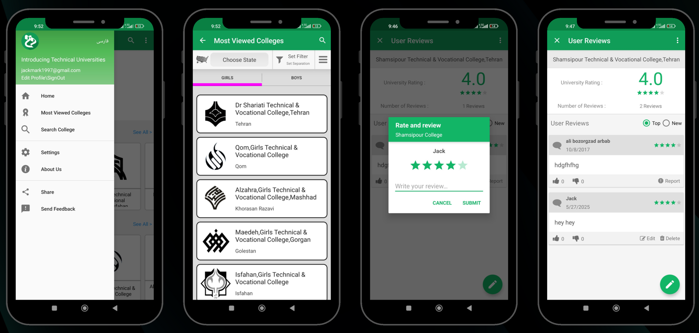

# Introducing TVUs

Introducing TVUs is an Android application that helps users discover technical and vocational universities in Iran. The app provides detailed information, user reviews, and interactive features such as Google Sign-In and map integration.
An app that provides access to college pages, with features to rate and comment. Supports two languages.

## Screenshots

<!-- <p align="center">
  
  
  
</p> -->


## Features

- Browse technical and vocational universities in Iran
- View university details, images, and location on Google Maps
- Read and share user reviews
- Register and sign in with Google or email
- Share app via social media

## Getting Started

### Prerequisites

- Android Studio
- Android SDK 25+
- Gradle 3.3+

### Build & Run

1. Clone the repository:
    ```sh
    git clone https://github.com/yourusername/introducing-tvus-APP.git
    ```
2. Open in Android Studio.
3. Build and run the app on your device or emulator.

### Google Services

Add your `google-services.json` file to `app/` for Google Sign-In and Maps functionality.

## License

This project is licensed under the MIT License.

---

For more information, see the [app/build.gradle](app/build.gradle) and [app/src/main/AndroidManifest.xml](app/src/main/AndroidManifest.xml).